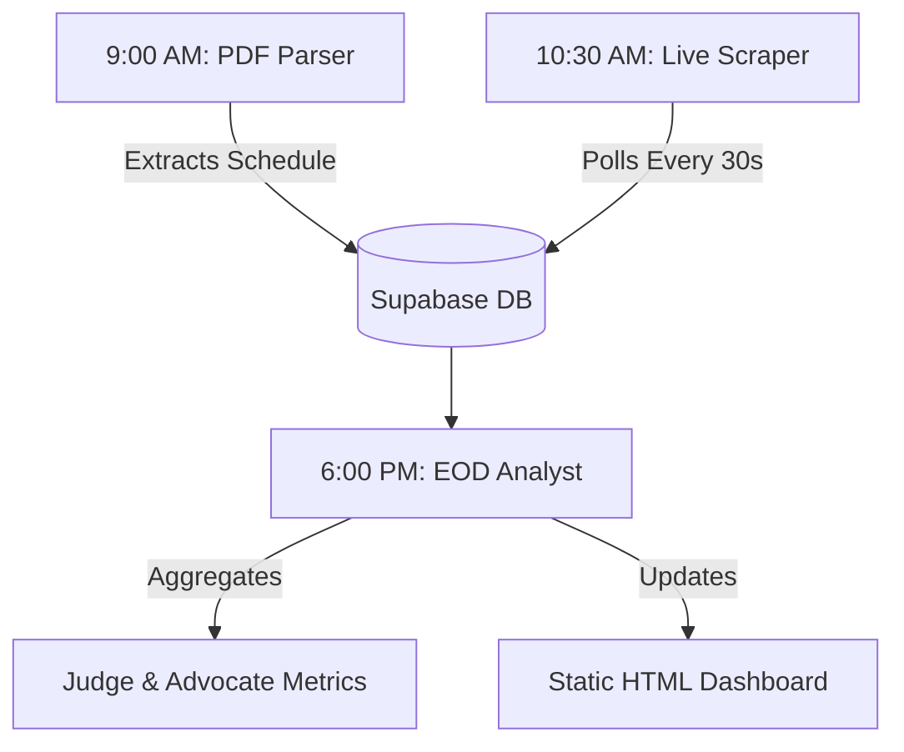

# 🏛️ Karnataka High Court Case Tracker

A high-performance intelligence system for the **Karnataka High Court (Bengaluru)**. This platform bridges the gap between the official **Cause List (Scheduled)** and the **Live Display Board (Actual)** to provide real-time transparency and long-term performance analytics.

---

## 🔄 System Architecture

The tracker operates as a three-stage pipeline, moving data from raw court sources into actionable insights.

### 1. The Parser (Structural Logic)
Using **Anchor-Based Regex**, the parser identifies 70+ specific Case Type codes (MFA, WP, etc.) to accurately isolate case metadata. It is designed to "heal" cases split across page breaks and handle connected matters (e.g., Sl No 44.1).

### 2. The Scraper (High-Frequency Polling)
A lightweight engine that monitors the Live Display Board. It tracks the precise moment a case is called and finished, providing the raw data needed to calculate court efficiency.

### 3. The Analyst (Transactional SQL)
The **End-of-Day (EOD) Engine** executes bulk transactional logic inside PostgreSQL to generate performance leaderboards and update historical tracking.

---

## 🛡️ "Risk-Free" Design Features

This version (v2.1) has been specifically hardened to handle the unpredictable nature of legal data:

*   **Alphanumeric-Ready:** Fully supports modern Court Hall designations (e.g., **Hall 2A**) and complex Serial Numbers (e.g., **Sl No 32(a)**).
*   **Type-Safe Ingestion:** All volatile fields are stored as `TEXT` to prevent system crashes during PDF formatting changes.
*   **Smart Cleaning:** Automatically strips page footers and "Connected With" markers mid-stream to ensure data continuity.
*   **Asynchronous RPC:** Data insertion is handled via PostgreSQL Functions (RPC), reducing network overhead and ensuring atomic updates.

---

## 📊 Analytics & Insights

The system transforms raw strings into the following metrics:

| Category | Insights Generated |
| :--- | :--- |
| **Judges** | Hearing efficiency, cases-per-hour, and monthly performance ranking. |
| **Advocates** | Appearance frequency, disposal rates, and listing-to-hearing ratios. |
| **Halls** | Daily "Not Reached" backlogs and hall-specific workload distribution. |
| **Cases** | Comprehensive history including every listing date and appearance status. |

---

## 🚀 Deployment Modes

| Option | Best For | Architecture |
| :--- | :--- | :--- |
| **Hybrid (Recommended)** | **Precision** | Local Mac (15s scraping) + GitHub Actions (Daily Logic). |
| **GitHub Actions** | **Automation** | 100% Cloud-based using GitHub's free compute tier. |
| **Local macOS** | **Control** | Full local control using LaunchAgents and Cron. |

---

## 📈 Data Lake & Storage

To balance performance and cost, the system utilizes a **Hybrid Storage Strategy**:

1.  **Live Database (Supabase):** Stores active daily data for the real-time dashboard.
2.  **Daily Archive (CSV Bucket):** At EOD, raw data is archived into datestamped CSV files. This allows the Live Database to be "wiped" daily, keeping the system lean and fast.
3.  **Intelligence Layer:** A persistent `case_history` table retains minimal unique IDs to track long-term case trends without excessive storage overhead.

---

## 📊 Dashboard & Visualization

The system automatically generates a **Static HTML Dashboard** featuring:
- ✅ **Weekly Efficiency Trends** (via Chart.js)
- ✅ **Judge Performance Leaderboard**
- ✅ **Maintenance Banners** for real-time system status updates.

---

## ⚖️ Disclaimer
This is an independent analytics project. Data is sourced from publicly available records on the Karnataka High Court website. It is not an official legal record.

**Status:** `Active Development` | **Version:** `2.1 (Alphanumeric Update)`
